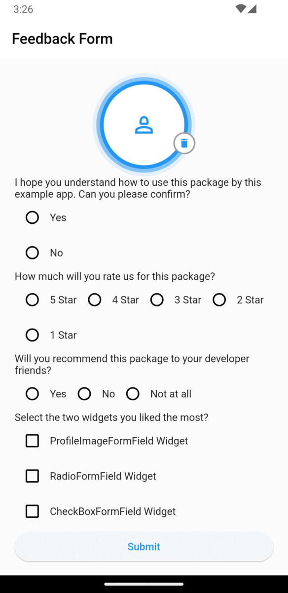

<!--
This README describes the package. If you publish this package to pub.dev,
this README's contents appear on the landing page for your package.

For information about how to write a good package README, see the guide for
[writing package pages](https://dart.dev/guides/libraries/writing-package-pages).

For general information about developing packages, see the Dart guide for
[creating packages](https://dart.dev/guides/libraries/create-library-packages)
and the Flutter guide for
[developing packages and plugins](https://flutter.dev/developing-packages).
-->

This package provides devlopers a variety of Custom Widgets that can be used with Form. 

## Features

The package contains some Widgets that can be used in the Form. They have validation function which can help developer to display error Text if input is not satisfied by the function. By Default Flutter sdk doesn't povide validation Feature on some input fields.

## Getting started

Add flutter_form_fields under dependencies in pubspec.yaml file.
 
## example



## Usage

```dart
final RadioFormFieldController radioController = RadioFormFieldController();
final ProfileImageFormFieldController profileImageController = ProfileImageFormFieldController();
final CheckBoxFormFieldController checkboxController = CheckBoxFormFieldController();

ProfileImageFormField(
            controller: profileImageController,
            validator:(imageFile){
               /// Validation Condition
            }
          ),

RadioFormField(
            titleText: "How much will you rate us for this package?",
            controller: radioController,
            values: const {
              "5 Star": 5,
              "4 Star": 4,
              "3 Star": 3,
              "2 Star": 2,
              "1 Star": 1,
            },
            validator: (val) {
                /// Validation Condition
            },
          ),

CheckBoxFormField(
            titleText: "Select the widgets you liked the most?",
            values: const {
              "ProfileImageFormField Widget": ProfileImageFormField,
              "RadioFormField Widget": RadioFormField,
              "CheckBoxFormField Widget": CheckBoxFormField
            },
            controller: mostLikedWidgetsController,
            validator: (values) {
                /// Validation Condition
            },
          ),
```

## Additional information

See example section to see more about using this package.
